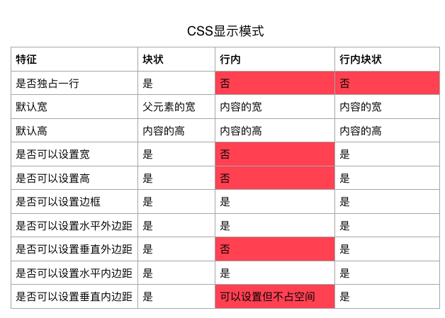

### HTML中标签的分类
* 容器级

能嵌套其它所有标签的标签

> div header nav section article footer h ul ol dl li dt dd a ...

* 文本级

只能嵌套文字/图片/视频/音频/超链接的标签

> p span b u i s stong em ins del ...

### CSS中标签的分类

* 常见的块级元素

> p div header nav section article footer h ul ol dl li dt dd ...

* 常见的行内元素

> span b u i s stong em ins del ...

* 常见的行内块级元素

> img input textarea ...

### CSS元素显示模式的转换

* 给元素添加display属性可以手动的改变元素的显示模式,常见取值有:

> * block 块级 
> * inline 行内
> * inline-block 行内块级

### 行内块状元素垂直对齐

* 什么是基线

其实网页中的文字可以想象为显示在四线各种,而四线格中底部倒数第二条线就是基线

> 注意点:如果给元素设置了行高,四线格的高度还是文字的高度

* 如何设置垂直对齐

> * 格式:vertical-align:baseline|top|middle|bottom|text-bottom
> * 注意点
>> * 只有行内块状元素设置vertical-align属性才有效 
>> * 默认的对齐方式是baseline(基线对齐)
>> * top是相对于父元素的顶部对齐
>> * middle是相对于父元素的中部对齐
>> * bottom是相对于是相对于父元素的底部对齐
>> * text-bottom是相对于父元素的文字底部对齐