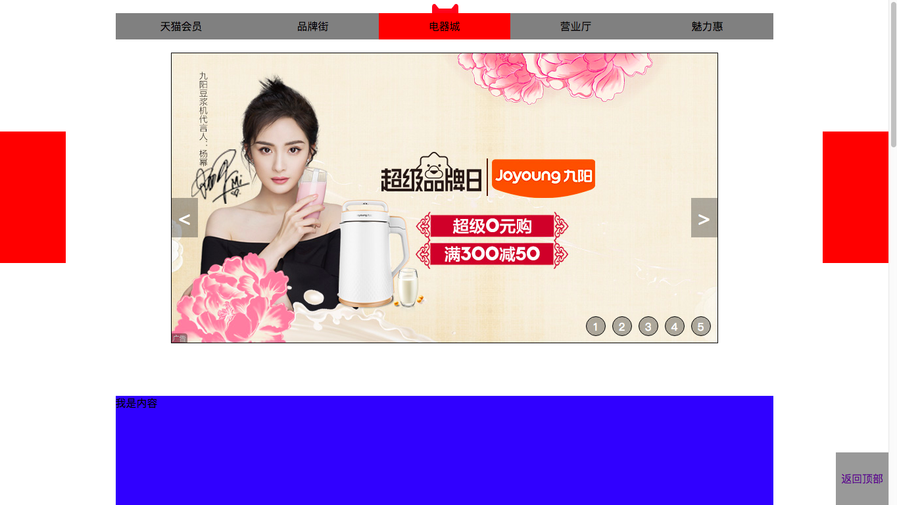

### 相对定位 
相对于自己在标准流当中的位置发生的移动

* 注意点

> * 只写position: relative;元素是不会发生任何移动的,需要配合设置四条边的移动距离来一起使用
> * 设置四条边的移动距离分别用 top|right|bottom|left
> * 四条边的移动距可以写一个,也可以写两个,写两个的时候要注意在同一个方向的只能设置一个边
> * 相对定位元素是不脱离标准流的,所以相对定位元素在标准流当中的空间不会释放出来
> * 相对定位元素是不脱离标准流的,所以相对定位元素区分块状，行内，行内块状
> * 如果元素有margin/border/padding值,相对定位是在margin/border/padding值生效后起作用
> * 相对定位元素主要用来对元素进行微调和设置绝对定位的参考元素

### 绝对定位
相对于父元素发生位置的移动

* 注意点

> * 只写position: absolute;元素是不会发生任何移动的,需要配合设置四条边的移动距离来一起使用
> * 设置四条边的移动距离分别用 top|right|bottom|left
> * 四条边的移动距可以写一个,也可以写两个,写两个的时候要注意在同一个方向的只能设置一个边
> * 绝对定位元素是脱离标准流的,所以绝对定位元素在标准流中的空间会被释放出来
> * 绝对定位元素是脱离标准流的,所以绝对定位元素不区分块状,行内,行内块状

* 绝对定位元素的参考点

> * 绝对定位元素会参考离他最近的具有定位属性的祖先元素,如果祖先中没有定位元素就参考body元素,换句话说如果一个元素设置为绝对定位,首先去找他的父元素,看他的父元素有没有position属性,如果没有就找他的父亲的父亲,直到找到第一个具有position属性的祖先,然后相对于该祖先发生位置移动,如果所有祖先都没有position属性,就相对于body发生位置的移动
> * 具有定位属性指的是相对定位,绝对定位,固定定位,但不包括静态定位
> * 父元素的margin/border的值对绝对定位的子元素的位置没有影响,绝对定位的子元素是从父元素的padding区域开始参考的,但如果相对于body,始终相当于相对于浏览器的首屏的可视区域

* 相对定位和绝对定位配合使用的方法

> * 子元素用绝对定位
> * 需要参考的父级元素用相对定位

* 绝对定位的元素水平居中

> left:50% (相对于贴靠元素的50%)
> margin-left: - 元素宽度的一半

### 固定定位  
参照body发生位置的移动,固定定位的元素不会随着滚动条的移动而移动

* 注意点

>* 只写position: fixed;元素是不会发生任何移动的,需要配合设置四条边的移动距离来一起使用
>* 设置四条边的移动距离分别用 top|right|bottom|left
>* 固定定位元素是脱离标准流的,所以固定定位元素在标准流中的空间会被释放出来
>* 固定定位元素是脱离标准流的,所以固定定位元素不区分块状,行内,行内块状
>* 固定定位元素不会随着滚动条的移动而移动
>* 固定定位元素始终参考的都是body 

### 静态定位

>* 默认情况下是静态定位

### 定位流中元素显示的顺序

* 默认情况下,定位流中的元素会盖住标准流中的元素
* 默认情况下,定位流中后面的元素会覆盖住前面的元素
* 可以通过z-index来更改元素的覆盖关系,值越大,显示越靠前,默认值是0
* 父级元素的z-index属性会影响到子元素的z-index,子元素的z-index属性最终的值是所有父级元素中最顶层父级元素的z-index值

### 案例练习

