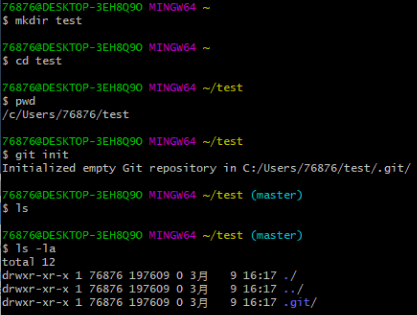

# 1. 什么是Git
Git是目前世界上最先进的分布式版本控制系统,Git的作者就是Liunx的作者-Linus
# 2. Git安装
## 2.1 Windows用户 
windows用户[下载](https://git-for-windows.github.io)后安装,安装后通过Git bash打开终端
## 2.2 Mac用户
```
$ brew install
```
## 2.3 Linux用户
```
sudo apt-get install git
```
# 3. 学点常用的命令
## 3.1 查询目录内容命令 ls(list)
```
ls //查看当前目录下的所有目录
```
## 3.2 改变目录 cd(change directory)
```
cd test //切换到test目录下
```
> 注意:
> 
> 1. .代表当前目录
> 
> 2. ..代表上一层目录
> 
> 3. /代表根目录或者目录分割符
## 3.3 新建目录 mkdir(make directories)
```
mkdir test //在当前所在的目录下面新建一个目录(test)
```
## 3.4 查询当前目录 pwd(print working directory)
```
pwd
```
# 4. 自报家门
```
git --global config user.name tom //你是谁
git --global config user.email 76876201@qq.com //怎么联系到你
git config user.name //查看我是谁
git config user.email //查看我的联系方式
```
# 5. 创建版本库
```
mkdir test
cd test
git init
```

> 注意:
> 
> 1.新建的目录必须是英文 
> 
> 2.git为隐藏目录,不能随便更改

# 6. 查看状态
```
git status
```
# 7. 添加文件到版本库中
* 第一步，用命令**git add**告诉Git，把文件添加到仓库
```
git add test.txt
```
* 第二步，用命令**git commit**告诉Git，把文件提交到仓库
```
git commit -m 'add text file'
```

> 注意:
> 
> 1.Git只能跟踪文本文件的改动，比如TXT文件，网页，所有的程序代码等等
> 
> 2.不要使用Windows自带的记事本编辑任何文本文件
> 
> 3.文件一定要放在.git所在目录或者所在目录的子目录中
> 
> 4.可以使用**git add . **把所有的改动添加到仓库
> 
> 5.**git add**可以多次执行

# 8. 工作区,版本库,暂存区
## 8.1 工作区（Working Directory）
电脑里能看到的目录
## 8.2 版本库（Repository）
隐藏目录.git
## 8.3 暂存区（Stage）
在版本库中的一片存储区域
> 注意:
> 
> 1.git add命令实际上就是把要提交的所有修改放到暂存区（Stage）
> 
> 2.git commit命令实际上就是一次性把暂存区的所有修改提交到仓库
> 
> 3.git commit只负责提交暂存区的修改,在工作区修改了但是没有添加到暂存区的修改不会被提交

# 9. 删除文件
## 9.1 方法一(推荐),通过**git rm**删除,然后git commit
* 第一步,通过**git rm**删除
```
git rm text.txt
```
* 第二步,通过git commit把修改提交到仓库
```
git commit -m 'delete file'
```

## 9.2 方法二,在工作区删除,然后git add 和 git commit
* 第一步,在工作区把文件删除
* 第二步,通过git add把修改提交到暂存区
```
git add text.txt
```
* 第三步,通过git commit把修改提交到仓库
```
git commit -m 'delete file'
```
> 注意:git rm的方式删除其实就是把工作区的文件删除掉然后提交到暂存区

# 10. 重命名文件
* 第一步,通过**git mv**重命名
```
git mv test.txt test2.txt //把test.txt重命名为test2.txt
```
* 第二步,通过**git commit**把修改提交到仓库
```
git commit -m 'rename file'
``` 

> 注意:在工作区手动更改文件名会被git认为是删除了一个文件然后再新建一个文件 

# 11. 撤销修改
## 11.1 **git checkout -- file** 丢弃工作区的修改
```
git checkout -- test.txt //丢弃工作区对text.txt的修改
```
> 注意: 
> 
> 1. git checkout -- file 是让这个文件回到最近一次git commit或git add时的状态
> 
> 2. git checkout -- file 命令中的--不能省略,省略就变成了“切换到另一个分支”
## 11.2 **git reset HEAD file** 丢弃暂存区的修改
```
git reset HEAD test.txt
```
> 注意:
> 
> 1. git reset HEAD file只是把暂存区的修改撤销掉,工作区的修改还在,可以继续通过git checkout -- file来撤销工作区的修改
> 
> 2. HEAD表示当前版本
## 11.3 **git reset --hard HEAD或者commit_id** 版本回退
```
git reset --hard HEAD //回退到当前版本,即工作区的内容和最后一次commit的内容一致
git reset --hard 34cd34343 //回退到commit id为34cd34343的版本
```
> 注意:
> 
> 1.Git的版本回退速度非常快，因为Git在内部有个指向当前版本的HEAD指针，当你回退版本的时候，Git仅仅是改变HEAD指针的指向
> 
> 2.用HEAD表示当前版本,上一个版本就是HEAD^，上上一个版本就是HEAD^^
> 
> 3.回退前,用**git log**可以查看提交历史，以便确定要回退到哪个版本
> 
> 4.如果找不到回退前的commit id,可以用**git reflog**查看命令历史，以便确定哪个版本
# 12. 远程仓库GitHub
## 12.1 什么是GitHub
GitHub是一个基于git的免费的远程仓库

## 12.2 申请GitHub帐号
## 12.3 创建一个新的空仓库

# 13. 同步远程仓库
## 13.1 本地有仓库,同步到GitHub上
* 第一步,在Github上创建一个空仓库
* 第二步,在本地仓库所在目录添加一个远程仓库
```
git remote add origin https://github.com/kuazhu/test.git
```

> 注意:
> 
> 1.origin远程库的名字，这是Git默认的叫法，也可以改成别的，但是origin这个名字一看就知道是远程库
> 
> 2.https://github.com/kuazhu/test.git 是远程库的地址,github地址分为https协议和ssh协议两种,如果没有添加ssh的公钥到github上可以使用https协议的地址
> 
> 3.如果第一次使用,https的地址在推送内容到远程库上时需要输入github的用户名和密码
> 
> 4.可以通过 git remote remove origin来删除远程库
> 
> 5.可以通过 git remote -v 来查看远程库

* 第三步,本地库的内容推送到远程库
```
git push -u origin master
```

> 注意:
> 
> 1.用git push命令，实际上是把当前master分支推送到远程
> 
> 2.由于远程库是空的，我们第一次推送master分支时，加上了-u参数，Git不但会把本地的master分支内容推送的远程新的master分支，还会把本地的master分支和远程的master分支关联起来,下次推送时用**git push**就可以了
> 
> 3.origin就代表了远程仓库的地址,这里也可以直接用远程仓库的地址,如:
> 
> ```
> git push -u https://github.com/kuazhu/test.git master
> ```
> 

## 13.2 GitHub上有仓库,同步到本地
* 第一步,在github上创建一个空仓库
* 第二步,把github上的仓库克隆到本地
```
git clone https://github.com/kuazhu/test2.git
```

> 注意:
> 
> 1.和在本地添加远程仓库一样,github地址分为https协议和ssh协议两种,如果没有添加ssh的公钥到github上可以使用https协议的地址
> 
> 2.如果第一次使用,https的地址在推送内容到远程库上时需要输入github的用户名和密码
> 
> 3.git clone的仓库在本地可以直接用**git push**推送修改到远程仓库
> 
> 4.推荐使用这种方式来新建并管理自己的项目
# 14. 使用ssh协议的仓库地址
* 第一步,生成ssh key(如果没有的话)
```
ssh-keygen -t ras -C '76876291@qq.com' //邮件写配置git时的邮件地址
```
> 注意:
> 
> 1.会生成一个私钥文件(id_rsa)和公钥文件(id_rsa.pub)
> 
> 2.保管好私钥文件不被泄漏

* 第二步,把公钥文件的内容原封不动的拷贝到github上
* 第三步,使用ssh协议的远程地址

> 注意:
> 
> 1.可以在添加远程库或者从github上克隆时使用
> 
> 2.使用ssh除了不需要输入密码外,由于ssh支持原生的git协议,所以速度最快
> 
> 3.ssh是一种网络协议，主要用于计算机之间的加密登录

# 15. 集中式vs分布式简介